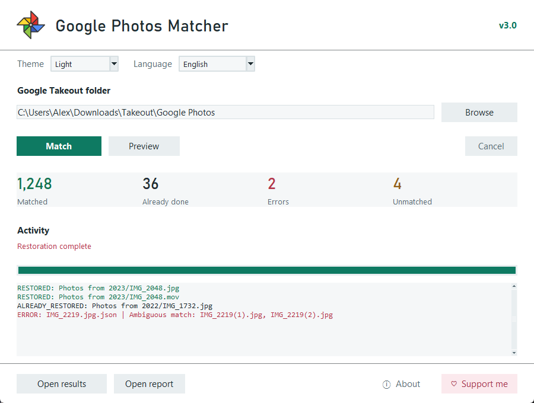
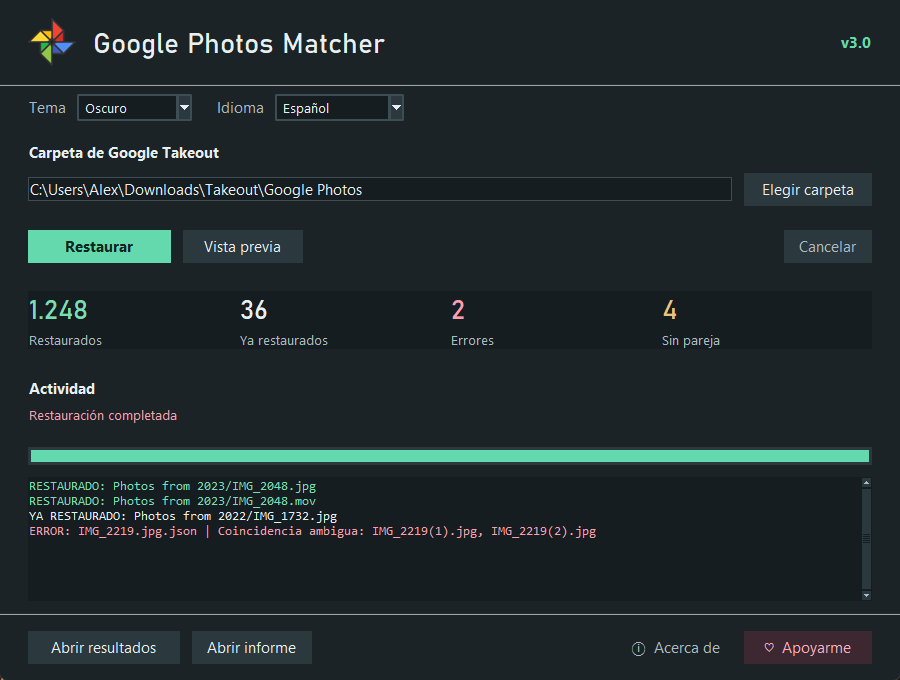

# Google Photos Matcher (v3.0)

**[Download for Windows (v3.0)](https://github.com/anderbggo/GooglePhotosMatcher/releases/download/v3.0/GPMatcher.exe)** | [Release notes](https://github.com/anderbggo/GooglePhotosMatcher/releases/tag/v3.0)

Windows 64-bit. Portable: no installation, Python, or separate ExifTool setup required.

> Simple tool to restore metadata (date, GPS coordinates, etc.) from Google Photos JSON files back into your original images and videos — just like [MetadataFixer](https://metadatafixer.com/pricing), but **free and open source**!
>
> 

<details>
<summary>Dark mode and Spanish interface</summary>

</details>


---

## How it works 📖

When you download media from Google Photos via Takeout, the files lose important metadata such as the date taken and GPS coordinates. Google stores this data separately in `.json` sidecar files.

**GPMatcher** reads those JSONs and writes metadata directly into the original photos and videos. Successfully restored media are moved into `MatchedMedia`, while original versions of edited photos go into `EditedRaw`. Both folders preserve the export's subfolder structure. JSON sidecars are deleted after a successful restoration; failed or unmatched media and their JSON remain in their original folders.

**Make a backup before using Match.** There is no automatic copy or undo: if writing fails partway through, some metadata may already have changed. The app displays a confirmation before every Match run; Preview does not modify or move media.

Matching uses both the JSON filename and its `title`, including numbered duplicates, supplemental metadata suffixes, case differences, Unicode normalization, edited versions, and recognizable Takeout truncation patterns. Ambiguous matches are reported instead of guessed.

---

## Usage (EXE — no setup required) 🚀

1. Download your _Google Photos_ media from [Google Takeout](https://takeout.google.com/) and extract the downloaded ZIP archives first. GPMatcher processes folders, not ZIP files.

2. [Download GPMatcher for Windows from Release v3.0](https://github.com/anderbggo/GooglePhotosMatcher/releases/download/v3.0/GPMatcher.exe) and double-click it to open. Everything needed is included; no configuration or compilation is required.

3. Select the folder containing your images/videos and their JSONs (e.g. `Photos from 2022` or the root `Takeout` folder)

   > The app will automatically scan all subfolders

4. Click **Preview** to inspect the matching plan without writing media, or **Match** to process it. Before Match starts, the app recommends a backup and asks for explicit confirmation. **Cancel** stops after the current file is completed.

5. Restored media appear in `MatchedMedia`; original versions of edited photos are stored in `EditedRaw`. JSON files for successful matches are deleted, not copied into the output. Failed media stay in their original folders with their JSON. Click **Open results** or **Open report** to inspect the output. The CSV report lists only errors, with the JSON, affected media, and cause. Successful matches, previews, skipped sidecars, and unmatched media are omitted from the CSV; the app's counters still show the complete summary. If there are no errors, the CSV contains its column headers only.

Existing output files are never overwritten; conflicts are checked before modifying media. MatchedMedia and EditedRaw must be on the same filesystem as the original export so files can move without copying. ExifTool may still need temporary disk space to rewrite a file's internal metadata. Successfully moved files are excluded from subsequent runs.

ExifTool is kept open during each processing run so images, videos, and Live Photo checks reuse the same process instead of repeatedly loading its engine. It is closed when the run finishes or fails; operations still have a timeout and errors are checked individually. Metadata containing line breaks uses a separate invocation to preserve its content safely. Large videos can still be limited by disk speed and ExifTool's internal file rewriting.

### Theme and language

Choose **System**, **Light**, or **Dark** from the theme selector, and **System**, **English**, or **Español** from the language selector. With System selected, the app detects the operating system's app theme and language at startup; Spanish is selected automatically on a Spanish-language system, and other languages use English.

Manual choices are remembered in your user profile. Theme and language can be changed without restarting the window or interrupting a restoration. Buttons provide hover, pressed, keyboard-focus, and disabled-state feedback. The activity log highlights successes and errors and translates common messages; filenames, metadata, and the CSV report's technical fields remain unchanged.

---

## FAQs ❓

### What happens to edited photos?

If an edited image shares its JSON with the original, both versions receive the JSON's metadata: the edited version moves into `MatchedMedia` and the original moves into `EditedRaw`. For example, `example-edited.png` goes into `MatchedMedia`, while `example.png` goes into `EditedRaw` after both have been restored from the same JSON.

If the edited image has its own JSON, each version is restored using its own metadata and the same folder separation is preserved. Existing output files are never overwritten, and output folders are excluded from scanning.

Common edited-photo suffixes are detected automatically, including `editado`, `editada`, `edited`, `modifié`, and `bearbeitet`. No manual suffix setting is needed.

### Why do some files stay unmatched?

Open the CSV report to see the reason. Recognizable special characters and duplicate-name patterns are handled automatically. If several files are plausible, GPMatcher does not modify them. Missing media, conflicting sidecars, invalid timestamps/GPS, unsupported formats, and ExifTool errors are reported explicitly. Failed writes retain the original location and JSON, but may have partially updated metadata; restore from your backup if needed.

### Which formats are supported?

ExifTool is included in the standalone Windows build. It is still required separately when running the Python source or using an older, unbundled executable.

- JPEG/JPG: restored with piexif, with ExifTool as a fallback for problematic EXIF. Apple MakerNotes use ExifTool to preserve Live Photo metadata.
- HEIC/HEIF, PNG, WebP, TIFF/TIF: require ExifTool.
- MP4, MOV, 3GP, M4V: require ExifTool.
- MKV: detected and reported, but not restored because ExifTool cannot write its metadata.

Capture timestamps are interpreted in the computer's local timezone. EXIF timezone offsets and QuickTime UTC conversion are updated consistently; Takeout does not always provide the original capture timezone.

### What happens to Live Photos?

A companion MOV/MP4 without its own JSON is processed only when its Apple content identifier matches the image's existing identifier. Matching filenames alone are not enough. Identifiers are preserved and checked after writing; missing or conflicting identifiers are not automatically invented or overwritten. A video with its own JSON uses its own metadata. Compatibility with Apple Photos still needs validation on real exports in macOS.

---

## For developers 🛠️

> **Prerequisites:** Create a virtual environment at the root of the project first:
> ```
> python -m venv venv
> venv\Scripts\activate
> ```

Python 3.10 or newer is required. On macOS/Linux, activate with `source venv/bin/activate`; your Python installation must include Tkinter.

### Option A — Build the .exe

1. Install build dependencies:
   ```
   pip install -r "requirements-dev.txt"
   ```

2. On 64-bit Windows, run:
   ```
   python files/build.py
   ```

The build downloads the official ExifTool 13.59 Windows distribution using Windows' `curl.exe`, verifies its pinned SHA-256 against the [published checksum](https://exiftool.org/checksums-13.59.txt), checks its version, and embeds the complete portable runtime and original license files. Downloads are cached under `build/exiftool`; the application itself does not download anything.

For an offline build, supply the original ZIP instead:
```
python files/build.py --exiftool-archive "C:\Downloads\exiftool-13.59_64.zip"
```
The same checksum verification is required for offline archives.

`dist/GPMatcher.exe` is a single executable with ExifTool included. It appears without replacing an existing executable at the project root. Simply copying this EXE is enough for supported image/video formats; no adjacent ExifTool folder is needed. A Windows EXE does not run natively on macOS; macOS packaging must be built on macOS.

Running PyInstaller directly without the additional bundled resources creates an unbundled EXE. Use `files/build.py` for a standalone release.

ExifTool and its Windows/Perl runtime are third-party software with their own licenses. The original `LICENSE`, `Licenses_Strawberry_Perl.zip`, and readme files are retained inside the packaged resources. See the [ExifTool source](https://github.com/exiftool/exiftool) and [Windows package information](https://oliverbetz.de/pages/Artikel/ExifTool-for-Windows) for upstream sources and terms.

### Option B — Run without building

1. Install runtime dependencies:
   ```
   pip install -r "requirements.txt"
   ```

2. Install [ExifTool](https://exiftool.org/) for videos and image formats other than JPEG. Put it on your `PATH` or beside the source project so it can be detected automatically. On Windows, keep `exiftool.exe` and its `exiftool_files` folder together. This step applies to running the Python source, including macOS.

3. Run:
   ```
   python files/window.py
   ```

   This entry point now works on both Windows and macOS. The previous macOS entry point is kept as an alias:
   ```
   python files/mac.py
   ```

### Tests

The regression suite uses `unittest`, temporary exports, and real JPEG metadata writes. External tool failures and Live Photo identifiers are simulated so tests do not require ExifTool or modify personal files.

```
python -m unittest discover -s tests -v
```

---

## Contributors ✒️

- **[anderbggo](https://github.com/anderbggo)** — Author
- **[Kadawatcha](https://github.com/Kadawatcha)** — Contributor
- **[Golde2341](https://github.com/Golde2341)** — Contributor
- **[MoonjunGong](https://github.com/MoonjunGong)** — Contributor

## Buy me a coffee ☕

[](https://buymeacoffee.com/anderbggo)
